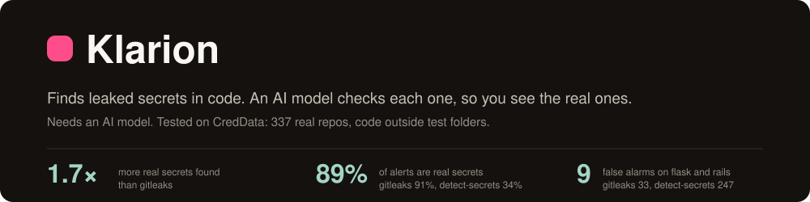
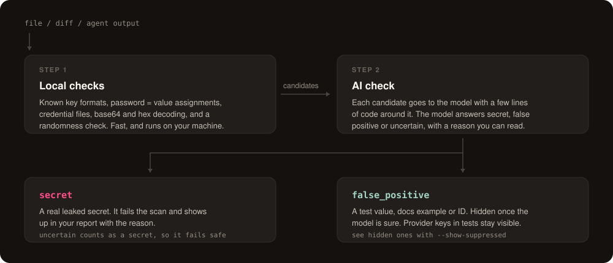

<div align="center">



<br><br>

[](https://github.com/0x1Adi/Klarion/actions/workflows/ci.yml)
[](https://pkg.go.dev/github.com/0x1Adi/Klarion)
[](./LICENSE)

[Install](#install) · [Use it](#use-it) · [Results](#results) · [How it works](#how-it-works) · [Reference](./docs/reference.md)

</div>

---

Klarion finds secrets in your code: API keys, passwords and tokens.

It works in two steps:

1. **Find.** Fast local checks flag anything that looks like a secret.
2. **Check.** An AI model reads each one with the code around it and decides if it is real.

Pattern scanners stop at step 1, so they also flag test values, IDs and hashes. Klarion shows
you the real leaks.

```console
$ klarion scan .

services/billing/client.py
  [critical] stripe-secret-key  39:18  sk_l****4bQx
    verdict: secret (confidence 0.96)
    | stripe.api_key = "sk_l****4bQx"

Summary: 1 finding(s) across 1 file(s), 198 suppressed [1204 files scanned in 612ms]
```

## Install

```sh
go install github.com/0x1Adi/Klarion/cmd/klarion@latest
```

Or download a binary from the [releases page](https://github.com/0x1Adi/Klarion/releases).

Klarion needs an AI model. Pick one:

| Model | Setup |
| --- | --- |
| Anthropic (default) | `export ANTHROPIC_API_KEY=...` |
| OpenAI or compatible | `export OPENAI_API_KEY=...` and set `provider = "openai"` |
| Local model, nothing leaves your machine | Run Ollama and set `provider = "ollama"` |
| Your Claude Code login | Set `provider = "claude-cli"` |

Settings go in `.klarion.toml` under `[ai]`. All options are in the [reference](./docs/reference.md#configuration).

## Use it

| What you want | How |
| --- | --- |
| Scan a folder | `klarion scan .` |
| Block commits that add a secret | `klarion protect` |
| Block commits with the [pre-commit](https://pre-commit.com) framework | The `.pre-commit-config.yaml` below |
| Stop Claude Code from writing a secret | `/plugin marketplace add 0x1Adi/Klarion` then `/plugin install klarion@klarion` |
| Stop Cline, Cursor or any MCP agent from writing a secret | The MCP server below |
| Fail pull requests that add a secret | The GitHub Action below |
| Start on a repo that already has findings | `klarion baseline create`, so only new secrets fail |

```yaml
# .github/workflows/secrets.yml
name: secret-scan
on: [push, pull_request]

jobs:
  klarion:
    runs-on: ubuntu-latest
    permissions:
      contents: read
      security-events: write
    steps:
      - uses: actions/checkout@v6
        with:
          fetch-depth: 0
      - uses: 0x1Adi/Klarion@v0.3.8
        with:
          anthropic-api-key: ${{ secrets.ANTHROPIC_API_KEY }}
```

On a pull request it scans only what the PR adds. It caches the AI answers, so unchanged code
costs nothing. Findings show in the job log. On a private repo without GitHub Code Security,
add `upload-sarif: "false"` to skip the Security tab upload. GitLab CI and every option are in
the [reference](./docs/reference.md).

```yaml
# .pre-commit-config.yaml
repos:
  - repo: https://github.com/0x1Adi/Klarion
    rev: v0.3.8
    hooks:
      - id: klarion
        stages: [pre-commit]
```

Without the `stages` line the hook is off and runs only when you ask for it, with
`pre-commit run --hook-stage manual klarion`. The `klarion` hook builds Klarion with Go the
first time it runs; use `id: klarion-system` if klarion is already installed. Everyone who
commits needs a model set up.

```json
// ~/.cline/mcp.json, or the MCP settings of any other client
{
  "mcpServers": {
    "klarion": {
      "command": "klarion",
      "args": ["mcp"]
    }
  }
}
```

The agent calls `scan_text` before it writes code and `scan_file` before it commits. Approve
each call rather than auto-approving the server: `scan_file` reads any path it is given. With no
model configured the server hands each candidate and its decision rules to that agent to judge,
so it needs no API key. Configure one and Klarion judges instead. Full steps, including the
tools and how to verify the install: [llms-install.md](./llms-install.md).

## Results

Klarion found **about 1.7× more real secrets than gitleaks**, and 89% of its alerts were real
(gitleaks: 91%).

We tested Klarion v0.3.0 on [CredData](https://github.com/Samsung/CredData): 337 real open
source repos where Samsung labeled the lines that hold secrets. These numbers cover code
outside test folders.

| | Klarion | gitleaks | detect-secrets |
| --- | :--: | :--: | :--: |
| Real secrets found | **35%** | 21% | 35% |
| Alerts that were real | **89%** | 91% | 34% |
| False alarms on flask and rails | **9** | 33 | 247 |

Good to know:

- **Klarion skips test fixtures and docs examples on purpose.** CredData counts those as real.
  Counted that way, Klarion found 9% and gitleaks 46%.
- **Klarion's numbers come from a sample** of 612 AI checks with one model (Claude Haiku). The
  likely range is 30 to 40% found and 82 to 97% real.
- **CredData's labels came from what other scanners found**, which helps those scanners.

Full method and data: [benchmark/REPORT.md](./benchmark/REPORT.md).

## How it works



- **Step 1 runs on your machine.** It looks for known key formats, `password = value` style
  lines, credential files like `.pgpass`, and secrets hidden in base64 or hex. It also checks
  how random a string looks.
- **Step 2 asks the model.** Each candidate goes out with a few lines of code. The model
  answers secret, false positive or uncertain. Uncertain counts as a secret.
- **You can see what was hidden.** Run `klarion scan . --show-suppressed`.
- **Your code goes only to the model you pick.** Set `send_secret = false` to send a masked
  value instead. It is less accurate.

## Limits

- **It needs a model.** Without one, `klarion scan` and the commit hooks stop with an error.
  The Claude Code hook still blocks provider keys such as AWS, GitHub and Stripe, and the MCP
  server hands the candidates and its rules to your agent to judge.
- **The model can be wrong.** Check what it hid with `--show-suppressed`.
- **It finds secrets, it does not fix them.** Rotate any secret it finds.
- **Local hooks can be skipped** with `git commit --no-verify`. Run Klarion in CI too, with
  the Action. The pre-commit hook checks staged changes only, so in CI it has nothing to check.

## More

[Reference](./docs/reference.md) · [Benchmark](./benchmark/REPORT.md) · [Design](./DESIGN.md) ·
[Changelog](./CHANGELOG.md) · [Contributing](./CONTRIBUTING.md) · [Security](./SECURITY.md)

MIT © The Klarion Authors
